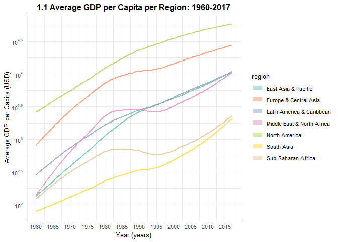
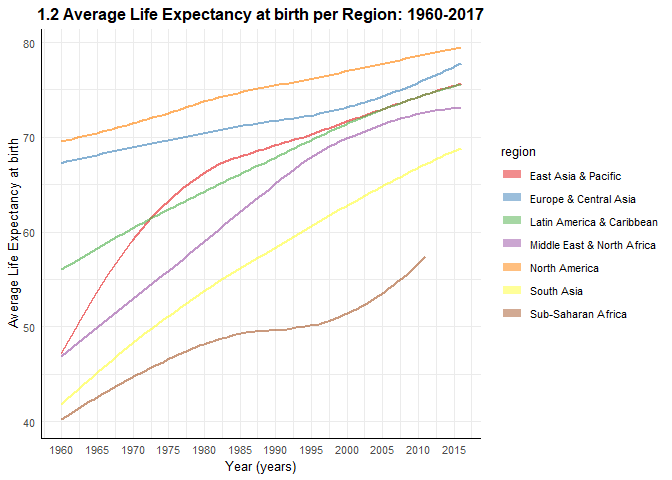
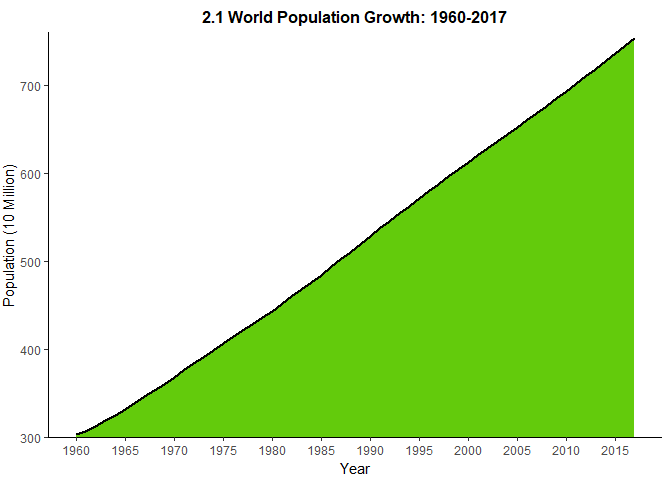
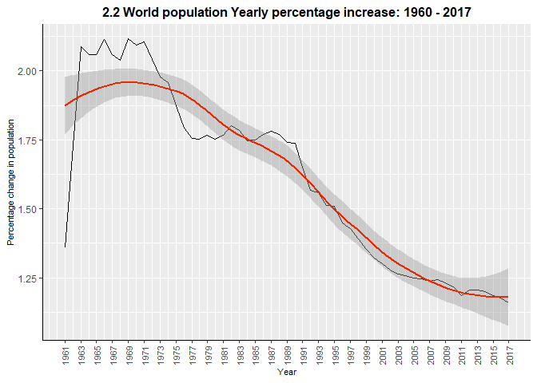
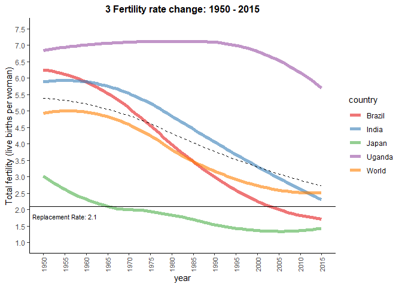
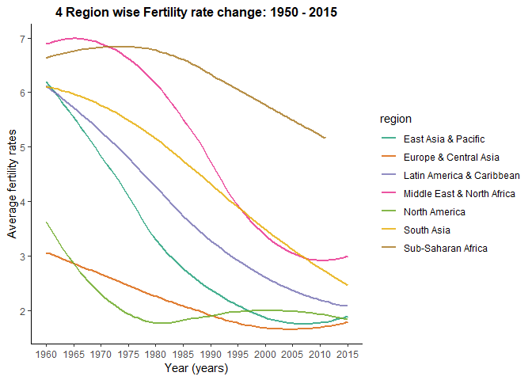

Ridley's Hypothesis Analyses and Visualisations
================
Akshay Kochhar
March 4, 2019

**Team-mates:**
---------------

1.  18230051 Akshay Kochhar
2.  18233559 Yifei Zhou

**Introduction:**
-----------------

According to Matt Ridley's hypothesis, "fertility rates everywhere will converge to 2.1 in a few decades, and the world population will stabilise at 9 billion people". The value 2.1 is the replacement rate. If the replacement rate in a country falls below 2.1, then its population will shrink over time.

Using the date of Fertility rate, GDP, Life Expectancy and population collected from the sites of United Nation and the World Bank, we have tried to illustrate through appropriate visualisations the evidence that might support Matt Ridley's hypothesis.

The main task completed are:

1.  Plots showing all the regions of the world are heading in the direction of higher GDP and higher Life Expectancy.
2.  Percentage increase in population of the world from 1950 till 2017 using ggplot.
3.  The change in fertility rates from 1950 to 2017 for rich and poor countries.
4.  Regional view of the fertility rates for the above time periods.

The tools used for this assignment are R programming language, and to support visualizations different packages like tidyverse,ggplot2,ggrepel,scales, etc were used.

**Deliverables:**
-----------------

``` r
#load required packages
library(tidyverse) #for data manipulation
library(ggplot2) #for declaratively creating graphics
library(scales) #Using transformat function
library(ggrepel) #repel overlapping text labels
options(scipen = 0) #use of scientific notation
library(ggridges) #provides geom_ridgeline and geom_density_ridges
```

### **Deliverable 1:**

Plots showing all the regions of the world are heading in the direction of higher GDP and higher Life Expectancy.

#### **1.1 Data Source**

The source of the data-set are:

1.  Life Expectancy: <https://data.worldbank.org/indicator/SP.DYN.LE00.IN?end=2016&start=1970&view=chart>
2.  Population: <https://data.worldbank.org/indicator/SP.DYN.LE00.IN?end=2016&start=1970&view=chart>
3.  GDP: <https://data.worldbank.org/indicator/NY.GDP.MKTP.CD>

#### **1.2 Data Pre-Processing**

*Note: The preprocessing steps are change into comments for R markdown file. These are just to share the work for assignment*

``` r
#############GDP#############

#getwd()

#setwd("E:/New Volume/Academic/NUIG_College/Data_Visulization/Assignment_3/AK/Data/GDP/")

#nations_data <- read.csv2('GDP.csv',header = FALSE, sep = ",")

#nations_data <- nations_data[-c(1,2),-c(3,4,63,64)]

#write.table(nations_data, file = "MyData.csv",row.names=FALSE,col.names=FALSE, sep=",")

#pre_data <- read.csv2('MyData.csv', sep = ",",stringsAsFactors = FALSE)

#str(pre_data)

#pre_data <- gather(pre_data,key = "Year", value = "GDP per capita", X1960:X2017)

#write.csv(pre_data, file = "MyData.csv", sep=",")

#Removing X

#test <- pre_data

#data_clean <- function(d){substring(d, regexpr('X',d) + 1, nchar(d))}

#pre_data$Year <- lapply(pre_data$Year,data_clean)

#pre_data$Year <- as.integer(pre_data$Year)

#pre_data$`GDP per capita` <- as.double(pre_data$`GDP per capita`)

#str(pre_data)

#setwd("E:/New Volume/Academic/NUIG_College/Data_Visulization/Assignment_3/AK/Data/GDP/")

#region_data <- read.csv2('Country_region.csv',sep = ",")

#region_data <- region_data[,-c(4,6)]

#Renaming the Country column to country so as to match with other dataset
#colnames(region_data)[1] <- "code"
#Renaming the Code column to code so as to match with other dataset
#colnames(region_data)[2] <- "region"
#Renaming the Year column to year so as to match with other dataset
#colnames(region_data)[3] <- "income"
#Renaming the Fertility rate column to simpler one
#colnames(region_data)[4] <- "country"

#Joining the 2 dataframes fertility info and nations info
#pre_data <- left_join(x = pre_data, y = region_data, by = c("country","code"), all = TRUE)

#write.csv(pre_data, file = "GDP_data_only.csv", sep=",", row.names=FALSE)

#############Life Expectancy#############

#setwd("E:/New Volume/Academic/NUIG_College/Data_Visulization/Assignment_3/AK/Data/Life_Expectancy/")

#life_pre <- read.csv2('life_expec.csv',header = FALSE, sep = ",")

#life_pre <- life_pre[-c(1,2),-c(3,4,63,64)]

#write.table(life_pre, file = "life_exp_pre.csv",row.names=FALSE,col.names=FALSE, sep=",")

#life_pre_data <- read.csv2('life_exp_pre.csv', sep = ",",stringsAsFactors = FALSE)

#str(pre_data)

#life_pre_data <- gather(life_pre_data,key = "Year", value = "Life_expc_at_birth", X1960:X2017)

#write.csv(life_pre_data, file = "life_exp_pre_tidy.csv", sep=",")

#data_clean <- function(d){substring(d, regexpr('X',d) + 1, nchar(d))}

#life_pre_data$Year <- lapply(life_pre_data$Year,data_clean)

#life_pre_data$Year <- as.integer(life_pre_data$Year)

#life_pre_data$Life_expc_at_birth <- as.double(life_pre_data$Life_expc_at_birth)

#str(life_pre_data)

#Renaming the Country column to country so as to match with other dataset
#colnames(life_pre_data)[1] <- "country"
#Renaming the Code column to code so as to match with other dataset
#colnames(life_pre_data)[2] <- "code"

#setwd("E:/New Volume/Academic/NUIG_College/Data_Visulization/Assignment_3/AK/Data/Life_Expectancy/")

#life_region_data <- read.csv2('life_expec_region.csv',sep = ",")

#life_region_data <- life_region_data[,-c(4,6)]

#Renaming the Country column to country so as to match with other dataset
#colnames(life_region_data)[1] <- "code"
#Renaming the Code column to code so as to match with other dataset
#colnames(life_region_data)[2] <- "region"
#Renaming the Year column to year so as to match with other dataset
#colnames(life_region_data)[3] <- "income"
#Renaming the Fertility rate column to simpler one
#colnames(life_region_data)[4] <- "country"

#Joining the 2 dataframes fertility info and nations info
#life_pre_data <- left_join(x = life_pre_data, y = life_region_data, by = c("country","code"), all = TRUE)

#write.csv(life_pre_data, file = "Life_expec_data_only.csv", sep=",", row.names=FALSE)

#getwd()

#setwd("E:/New Volume/Academic/NUIG_College/Data_Visulization/Assignment_3/AK/")

#life_region_final <- read.csv2('Life_expec_data_only.csv',sep = ",",stringsAsFactors = FALSE)

#GDP_region_final <- read.csv2('GDP_data_only.csv',sep = ",",stringsAsFactors = FALSE)

#Converting the year cloumn to factors
#life_region_final$Year=as.factor(life_region_final$Year)
#Converting the year column to factors
#GDP_region_final$Year=as.factor(GDP_region_final$Year)

#Joining the 2 dataframes GDP info and life info
#GDP_life_final <- left_join(x = GDP_region_final, y = life_region_final, by = c("country","code","Year","region","income"), all = TRUE)

#############Population#############

#population_pre <- read.csv2('population_data.csv',header = FALSE, sep = ",")

#population_pre <- population_pre[-c(1,2),-c(3,4,63,64)]

#write.table(population_pre, file = "population_pre.csv",row.names=FALSE,col.names=FALSE, sep=",")

#population_pre <- read.csv2('population_pre.csv', sep = ",",stringsAsFactors = FALSE)

#str(population_pre)

#population_pre <- gather(population_pre,key = "Year", value = "Pop_total", X1960:X2017)

#write.csv(population_pre, file = "population_data_tidy.csv", sep=",")

#data_clean <- function(d){substring(d, regexpr('X',d) + 1, nchar(d))}

#population_pre$Year <- lapply(population_pre$Year,data_clean)

#population_pre$Year <- as.integer(population_pre$Year)

#population_pre$Pop_total <- as.double(population_pre$Pop_total)

#Renaming the Country column to country so as to match with other dataset
#colnames(population_pre)[1] <- "country"
#Renaming the Code column to code so as to match with other dataset
#colnames(population_pre)[2] <- "code"

#str(population_pre)

#setwd("E:/New Volume/Academic/NUIG_College/Data_Visulization/Assignment_3/AK/Data/Population/")

#pop_region_data <- read.csv2('population_region.csv',sep = ",")

#pop_region_data <- pop_region_data[,-c(4,6)]

#Renaming the Country column to country so as to match with other dataset
#colnames(pop_region_data)[1] <- "code"
#Renaming the Code column to code so as to match with other dataset
#colnames(pop_region_data)[2] <- "region"
#Renaming the Year column to year so as to match with other dataset
#colnames(pop_region_data)[3] <- "income"
#Renaming the Fertility rate column to simpler one
#colnames(pop_region_data)[4] <- "country"

#Joining the 2 dataframes fertility info and nations info
#population_pre <- left_join(x = population_pre, y = pop_region_data, by = c("country","code"), all = TRUE)

#write.csv(population_pre, file = "population_data_only.csv", sep=",", row.names=FALSE)

#getwd()
```

``` r
#setwd("E:/New Volume/Academic/NUIG_College/Data_Visulization/Assignment_3/AK/")

#population_region_final <- read.csv2('population_data_only.csv',sep = ",",stringsAsFactors = FALSE)

#GDP_region_final <- read.csv2('GDP_data_only.csv',sep = ",",stringsAsFactors = FALSE)

#Joining the 2 dataframes GDP_life_final info and population_region_final info
#GDP_life_population_final <- left_join(x = GDP_life_final, y = population_region_final, by = c("country","code","Year","region","income"), all = TRUE)

#GDP_life_population_final <- GDP_life_population_final[,c(2,1,3,4,7,8,5,6)]

#GDP_life_final$GDP.per.capita <- as.numeric(GDP_life_final$GDP.per.capita)

#GDP_life_final$Life_expc_at_birth <- as.numeric(GDP_life_final$Life_expc_at_birth)

#write.csv(GDP_life_population_final, file = "GDP_life_pop_final_data.csv", sep=",", row.names=FALSE)
```

#### **1.3 Plots**

``` r
setwd("E:/New Volume/Academic/NUIG_College/Data_Visulization/Assignment_3/AK/")

GDP_life_pop_data <- read.csv2('UN_complete_data.csv',sep = ",",stringsAsFactors = FALSE)

GDP_life_pop_data$GDP.per.capita <- as.numeric(GDP_life_pop_data$GDP.per.capita)

GDP_life_pop_data$Life_expc_at_birth <- as.numeric(GDP_life_pop_data$Life_expc_at_birth)

GDP_life_pop_data$Pop_total <- as.numeric(GDP_life_pop_data$Pop_total)

GDP_life_pop_data <- filter(GDP_life_pop_data,GDP_life_pop_data$region != "")

regions <-GDP_life_pop_data %>% 
  select(region,Year, Pop_total, GDP.per.capita, Life_expc_at_birth) %>% 
  group_by(Year, region) %>% 
  summarize(ttl_pop_count = sum(Pop_total,na.rm = TRUE), gdp_prcap_avg = weighted.mean(GDP.per.capita, Pop_total, na.rm = TRUE), life_expect_avg = weighted.mean(Life_expc_at_birth, Pop_total,na.rm = TRUE ))

g_plot <-ggplot(regions, aes(x=Year, y=gdp_prcap_avg,color=region)) + 
  ggtitle("1.1 Average GDP per Capita per Region: 1960-2017") + 
    ylab("Average GDP per Capita (USD)") + 
    xlab("Year (years)") +
    scale_y_log10(labels = trans_format("log10", math_format(10^.x)), 
                  breaks = scales::trans_breaks("log10",function(x) 10^x))+
    scale_x_continuous(breaks=seq(1960,2017,5)) +
    scale_color_brewer(palette='Set2') + 
    scale_size_area(max_size = 8, labels  = comma) +
    theme_minimal(base_size=10) +
    guides(color = guide_legend(override.aes = list(size = 3, alpha = 0.5))) +
    geom_line(size = 0.8  , stat="smooth",method = "loess",se=FALSE, 
              na.rm = TRUE,  alpha = 0.8) + 
    theme(
    plot.title = element_text(hjust = 0.5, size = 12,face="bold"),
    axis.line = element_line(colour = "black", size = 0.25)
  )


plot(g_plot)
```



### Observations:

1.  The plot 1.1 shows the change in Average GDP per Capita (US$) for all the regions of the world.
2.  All the regions show an increase (upward trend) in GDP with the change in year from 1960 to 2017.
3.  The average GDP has more than doubled than its figure in 1960s.
4.  The y-axis has been scaled using 'log10' to incoporate all the values of GDP w.r.t year.
5.  'Set2' colour palette has been used to differentiate all the countries of the world. *I used different combinations, but it was visible on white background*
6.  The grid is used at the background so that an observer can read the increase in values with time.
7.  Since the lines are intersection, I have made them transparent by adding alpha value 8.

``` r
#Plot the data Life Expectancy with Time

g2_plot <-ggplot(regions, aes(x=Year, y=life_expect_avg,color=region)) + 
    ggtitle("1.2 Average Life Expectancy at birth per Region: 1960-2017") + 
    ylab("Average Life Expectancy at birth") + 
    xlab("Year (years)") +
    scale_x_continuous(breaks=seq(1960,2017,5)) +
    scale_color_brewer(palette='Set1') + 
    scale_size_area(max_size = 8, labels  = comma) +
  theme_minimal(base_size=10) +
  guides(color = guide_legend(override.aes = list(size = 3, alpha = 0.5))) +
  geom_line(size = 0.8, stat="smooth",method = "loess",se=FALSE, 
           na.rm = TRUE,  alpha = 0.6) + 
    theme(
      plot.title = element_text(hjust = 0.5, size = 12,face="bold"),
      axis.line = element_line(colour = "black", size = 0.25)
  )

plot(g2_plot)
```



### Observations:

1.  The plot 1.2 shows the change in Average Life Expectancy for all the regions of the world.
2.  All the regions show an increase (upward trend) with the change in year from 1960 to 2017,but there is slight decresing trend of Sub-Saharan Region.
3.  As the graph was about Age, the Y-axis has been kept simple. 4.'Set1' colour palette has been used to differentiate all the countries of the world. *I used different combinations, but it was visible on white background*
4.  The grid is used at the background so that an observer can guage the increase in values with time in first observations.
5.  The same plot design was adopted for 1.2 because we have to show variation in different regions. It could only be best presented only with geom\_line. The others were getting populated with intersection of values.

### **Deliverable 2:**

A plot showing how much the world population increased from 1950 to the present. For each year, the plot should show the percentage increase compared to the previous year. You should show a regression line fitted to the data.

#### **2.1 Data Source**

The source of the data-set are:

1.  Population: <https://data.worldbank.org/indicator/SP.DYN.LE00.IN?end=2016&start=1970&view=chart>

#### **2.2 Data Pre-Processing**

*The preprocessing steps for population data set is shown in 1.2*

#### **2.3.1 Plots**

As I observerd the data of population with increasing year,I found that the population has increased with year and shown upward trend. I objective was to show the increase of population and show the trend of increase. This can be best donw by using ridge-line. The below graph (2.1) shows sharp upward trend in population growth.

``` r
setwd("E:/New Volume/Academic/NUIG_College/Data_Visulization/Assignment_3/AK/")

world_populatoion <- read.csv2('GDP_life_pop_final_data.csv',sep = ",",stringsAsFactors = FALSE)

world_populatoion$Pop_total <- as.numeric(world_populatoion$Pop_total)

world_populatoion_plot <- world_populatoion %>% select(Year,country,Pop_total)  %>%
 filter(country == "World" ) 

#Dividing the world popluation by 10000000 so as to get the numbers in 10 million range

world_populatoion_plot$Pop_total <- (world_populatoion_plot$Pop_total / 10000000)

#Renaming the Population column to Population (10 Millions)

colnames(world_populatoion_plot)[3] <- "Population_10_Millions"


g_plot <- ggplot(world_populatoion_plot, aes(Year)) +
  geom_ridgeline(aes(height = Population_10_Millions, y=0), color = "#000000",
                 fill = "#63CB0C", size = .75) +
  ggtitle("2.1 World Population Growth: 1960-2017") +
  scale_y_continuous(limits = c(0, 800),breaks=seq(0,800,100), expand = c(0, 0),name = "Population (10 Million)") + 
scale_x_continuous(lim=c(1960,2017), breaks=seq(1960,2017,5)) +
  coord_cartesian(ylim=c(300, 760)) +
  theme_grey() +
  theme(
    plot.margin = margin(7, 7, 3, 1.5),
    plot.title = element_text(hjust = 0.5, size = 12,face="bold"),
    panel.grid.major = element_blank(), 
    panel.background = element_blank(), 
    axis.line = element_line(colour = "black", size = 0.25)
  )

g_plot
```



### Observations:

1.  The plot 2.1 shows the increase in population from 1960 to 2017.
2.  The green fill is used to emphasize the increase in population.
3.  The slope of the ridge-line (black colour) shows a sharp upward trend in population growth till 2017 from 1960.
4.  The plot shows that the population increased by more than 100% in 57 years.

#### **2.3.2 Plots**

``` r
#Prepare data for plot
world_populatoion_plot <- world_populatoion_plot %>% mutate(Previous_Year = lag(Population_10_Millions, 1), Change = Population_10_Millions - Previous_Year, Percent_Change = Change/Previous_Year*100)

graph <-  ggplot(world_populatoion_plot, aes(x = Year, y = Percent_Change)) +
  geom_line() +
  geom_smooth(method = "auto", colour = '#E82A04') +  #the smoothing method is chosen based on the size of the interval
  ylab("Percentage change in population") +
  ggtitle("2.2 World population Yearly percentage increase: 1960 - 2017") +
  scale_x_continuous(lim=c(1961,2017), breaks=seq(1961,2017,2)) +
  theme(
    axis.line = element_line(colour = "black", size = 0.25),
    plot.title = element_text(hjust = 0.5,size = 12, face = "bold"),
    axis.text.x = element_text(size=8, angle = 90, hjust=1, vjust = .5), title = element_text(size=8)
    )

graph
```



### Observations:

1.  The plot 2.2 demonstrates the change in world population growth as compared with previous year from 1960 to 2017.
2.  The solid black line shows shows the actual values, wheres the solid red line demonstrates the decrease in percentage increase as compared with previous year growth.
3.  The x-axis labels are vertically placed with a gap of 2 years to above the axis being cluttered.
4.  The solid line shows a sharp increase in the first year because there was no data before 1960.

### **Deliverable 3:**

Changing fertility rates from 1950 to the present for selected countries of the world.

#### **3.1 Data Source**

The source of the data-set are:

1.  Fertility Rate: <https://ourworldindata.org/fertility-rate>

*Data published by United Nations, Department of Economic and Social Affairs, Population Division (2017). World Population Prospects: The 2017 Revision, DVD Edition.*

#### **3.2 Data Pre-Processing**

``` r
#Preparing_Data

setwd("E:/New Volume/Academic/NUIG_College/Data_Visulization/Assignment_3/AK/Data/Fertility_Rate")

fertility_data <- read.csv2('children-per-woman-UN.csv', header = TRUE, sep = ",")

#Renaming the Country column to country so as to match with other dataset
colnames(fertility_data)[1] <- "country"
#Renaming the Code column to code so as to match with other dataset
colnames(fertility_data)[2] <- "code"
#Renaming the Year column to year so as to match with other dataset
colnames(fertility_data)[3] <- "year"
#Renaming the Fertility rate column to simpler one
colnames(fertility_data)[4] <- "fertility_rate"


nation_fertility_plot <- fertility_data %>% select(year, fertility_rate,country)  %>%
  filter(country %in% c("Japan", "Uganda", "India", "Brazil", "World" )) 


#Changing the year column to Date format
nation_fertility_plot$year <- as.integer(as.character(nation_fertility_plot$year), format = "%Y")
nation_fertility_plot$fertility_rate <- as.double(as.character(nation_fertility_plot$fertility_rate))
```

#### **3.3 Plots**

``` r
gg_1 <-ggplot(nation_fertility_plot, aes(year, fertility_rate, color = country)) +
    geom_line(size = 2 , stat="smooth",method = "loess",se=FALSE, na.rm = TRUE,  alpha = 0.6) + 
    stat_smooth(method= 'auto', se= FALSE, colour = "black", size = 0.6, linetype="dashed")+
    scale_x_continuous(breaks=seq(1950,2015,5)) +
    scale_y_continuous(breaks=seq(0,7.5,0.5))+ 
    ylab("Total fertility (live births per woman)")+
    ggtitle("3 Fertility rate change: 1950 - 2015")+
    geom_hline(yintercept=2.1) +
    scale_color_brewer(palette='Set1') +
    expand_limits(y = c(1, 7.5)) +                    #limiting the y-axis
    theme(
    panel.background = element_blank(),
    axis.line = element_line(colour = "black", size = 0.25), 
    plot.title = element_text(hjust = 0.5,size = 12, face = "bold"), 
    axis.text.x = element_text(size=8, angle = 90, hjust=1, vjust = .5), 
    legend.key = element_rect(fill = NA, colour = NA, size = 0.25)
     ) +
    annotate("text", x = 1955 , y = 1.8, 
           label = c("Replacement Rate: 2.1"), fontface=1, size=3) #adds test to replacement line

gg_1
```



### Observations:

Plot 3 demonstrates the fertility rate of change of fertility of the world from 1950 to 2015 as compared to the rate of change of fertility of four different nations for the same time period. In the graph, 'Japan' represents the 'rich group' of countries, 'Uganda' represents the 'poor' group of countries, ' newly developed' group is represented by 'Brazil', and 'India' is from 'developing' nations group.

1.  'Uganda' representing poor countries has fertility rate way above every other country.
2.  Though, 'Brazil' is considered as 'newly developed', its fertility rate decreased as compared with India in 1960s.
3.  'Worlds' fertility has been decreasing and getting closer to Replacement line.
4.  'Japan' population has been shrinking since 1965.
5.  All the nations and the world are differentiated using 'Set1' pallete which provides dark shades on white back-ground.
6.  As per the objective of the task, the Replacement rate: 2.1 is represented in the graph with the text mentioning it.
7.  The lines are made thick to distinguish one from another, and they are made trasparent to avoid confusion with alpha (0.6) to make it readable.
8.  A regression line demonstrated with dashed black line is added to help observer perceive the overall downward trend of fertility rate.
9.  The years are represented on x-axis vertically with a gap of 5 years to make it neat and observable for the observer.
10. The design of the plot is similar because we found these line graphs help in better segregation of multiple values, helping the presenter to show comparison.

### **Deliverable 4:**

The region wise change in fertility rates from 1950 to the present.

#### **4.1 Data Source**

The source of the data-set are:

1.  Fertility Rate: <https://ourworldindata.org/fertility-rate>

*Data published by United Nations, Department of Economic and Social Affairs, Population Division (2017). World Population Prospects: The 2017 Revision, DVD Edition.*

#### **4.2 Data Pre-Processing**

*Note: The pre-processing steps are change into comments for R markdown file. These are just to share the work for assignment*

``` r
#Pre-processing

#setwd("E:/New Volume/Academic/NUIG_College/Data_Visulization/Assignment_3/AK/")

#GDP_life_pop_data <- read.csv2('GDP_life_pop_final_data.csv',sep = ",",stringsAsFactors = FALSE)

#Renaming the year column to Year so as to match with other dataset
#colnames(fertility_data)[3] <- "Year"

#Adding firtility data to GDP_life_pop dataset

#GDP_life_pop_fert_data <- left_join(x = GDP_life_pop_data, y = fertility_data, by = c("country","code","Year"), all = TRUE)

#GDP_life_pop_fert_data <- filter(GDP_life_pop_fert_data,GDP_life_pop_fert_data$region != "" & GDP_life_pop_fert_data$income !="")

#GDP_life_pop_fert_data <- GDP_life_pop_fert_data[,c(1,2,3,4,5,6,9,7,8)]

#write.csv(GDP_life_pop_fert_data, file = "UN_complete_data.csv", sep=",", row.names=FALSE)

GDP_life_pop_fert_data <- read.csv2('UN_complete_data.csv',sep = ",",stringsAsFactors = FALSE)

GDP_life_pop_fert_data$Pop_total <- as.numeric(GDP_life_pop_fert_data$Pop_total)

GDP_life_pop_fert_data$fertility_rate <- as.numeric(GDP_life_pop_fert_data$fertility_rate)

regions_fert <-GDP_life_pop_fert_data %>% 
  select(region,Year, Pop_total, fertility_rate) %>% 
  group_by(Year, region) %>% 
  summarize(ttl_pop_count = sum(Pop_total,na.rm = TRUE), fert_rate_avg = weighted.mean(fertility_rate, Pop_total,na.rm = TRUE ))

head(regions_fert)
```

    ## # A tibble: 6 x 4
    ## # Groups:   Year [1]
    ##    Year region                     ttl_pop_count fert_rate_avg
    ##   <int> <chr>                              <dbl>         <dbl>
    ## 1  1960 East Asia & Pacific           1017908415          5.45
    ## 2  1960 Europe & Central Asia          660638384          2.96
    ## 3  1960 Latin America & Caribbean      220309836          5.95
    ## 4  1960 Middle East & North Africa     105488678          6.84
    ## 5  1960 North America                  198624409          3.52
    ## 6  1960 South Asia                     571835666          6.05

#### **4.3 Plots**

``` r
#Plot the data GDP with Time

g_plot <-ggplot(regions_fert, aes(x=Year, y=fert_rate_avg,color=region)) + 
    ggtitle("4 Region wise Fertility rate change: 1950 - 2015") + 
    ylab("Average fertility rates") + 
    xlab("Year (years)") +
    scale_x_continuous(breaks=seq(1960,2017,5)) +
    scale_color_brewer(palette='Dark2') + 
    #increase the size of the legend colour points, and their alpha value (too fain otherwise)
    geom_line(size = 0.8  , stat="smooth",method = "loess",se=FALSE, 
               na.rm = TRUE,alpha = 0.8) + 
    theme_grey() +
    theme(
    plot.title = element_text(hjust = 0.5, size = 12,face="bold"),
    panel.background = element_blank(), 
    axis.line = element_line(colour = "black", size = 0.25), 
    legend.key = element_rect(fill = NA, colour = NA, size = 0.25)# Center title position and size
  )


plot(g_plot)
```



### Observations:

1.  The plot 4 shows the change in Average fertility rates for all the regions of the world.
2.  All the regions show an decrease (downward trend) with the change in year from 1960 to 2017.
3.  As the graph was about number of births, the Y-axis has been kept simple. 4.'Dark2' colour palette has been used to differentiate all the countries of the world. *I used different combinations, but it was visible on white background*
4.  The same plot design was adopted from 1.2 because we have to show variation in different regions. It could only be best presented only with geom\_line. The others were getting populated with intersection of values.
5.  The year on x-axis are shown at the gap of 5 years to avoid clutter on the x-axis.

**Conclusion:**
---------------

1.  Plot 1 shows that that the GDP and life expextancy of all the regions of the world is increasing. Life expectancy increase further inluences the fertility rate.
2.  Plot 2 shows that even-though there is liner increase in world population, the percentage change is decrease.
3.  Plot 3 shared evidence that that the the GDP have inverse relation with fertility rate as in the case of 'Uganda' and 'Japan', and the world fertility is coming close to 2.1 replacement rate with passing year.
4.  Support evidence is plot 3, the plot 4 further make it evident that with decrease in fertility of the world, the fertility of all the regions is decreasing too.
5.  From the above arguments, we can safely conclude that these visulizations support Ridely's hypothesis.

**Contribution:**
-----------------

1.  Akshay Kochhar --- Q1, Q4 and report.
2.  Yifei Zhou --- Q3, Q5 and report.
